# ZScoreES Theory Validation Report
**Date:** 2026-03-22  
**Cluster:** Harvard FASRC kempner_h100  
**Output dir:** `/n/holylfs06/LABS/kempner_fellow_binxuwang/Users/binxuwang/DL_Projects/EvolStrategyTheory_validation_ddof0`

---

## Background

ZScoreES (Qiu et al. 2025) update rule:

$$\theta_{t+1} = \theta_t + \frac{\alpha}{N} \sum_{i=1}^N Z_i \epsilon_i, \quad Z_i = \frac{R_i - \mu_R}{\sigma_R}, \quad \alpha = \frac{\sigma}{2}$$

Three key propositions are validated numerically on synthetic landscapes.

---
## Exp 1: Flat Landscape — Drift Variance (Prop 1)

**Theory (Prop 1):**  $\mathbb{E}[||\Delta\theta||^2] = \alpha^2 d / N = \sigma^2 d / (4N)$  

**Cumulative:**  $\mathbb{E}[||\theta_T - \theta_0||^2] = \sigma^2 T d / (4N)$

### Exp 1a: One-step drift vs N and d

![Exp 1a: E[||Δθ||²] vs N for each d — empirical (solid) vs theory (dashed)](figures/exp1a_drift_vs_N.png)
*Exp 1a: E[||Δθ||²] vs N for each d — empirical (solid) vs theory (dashed)*

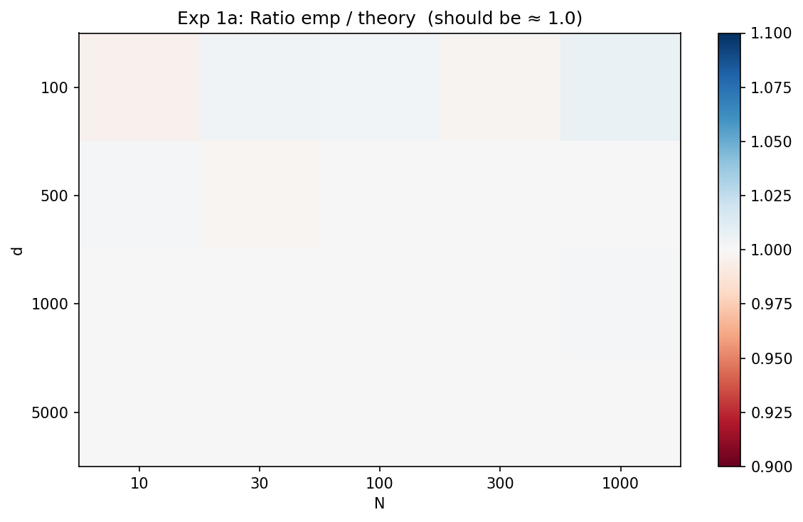
*Exp 1a: Ratio emp/theory heatmap (should be ≈ 1.0)*

**Summary table (selected rows):**

|         d |         N |    emp |   theory |   ratio |
|----------:|----------:|-------:|---------:|--------:|
|  100.0000 |   10.0000 | 0.0249 |   0.0250 |  0.9955 |
|  100.0000 |  100.0000 | 0.0025 |   0.0025 |  1.0028 |
|  100.0000 | 1000.0000 | 0.0003 |   0.0003 |  1.0070 |
|  500.0000 |   10.0000 | 0.1252 |   0.1250 |  1.0014 |
|  500.0000 |  100.0000 | 0.0125 |   0.0125 |  1.0001 |
|  500.0000 | 1000.0000 | 0.0012 |   0.0013 |  0.9996 |
| 1000.0000 |   10.0000 | 0.2498 |   0.2500 |  0.9994 |
| 1000.0000 |  100.0000 | 0.0250 |   0.0250 |  1.0005 |
| 1000.0000 | 1000.0000 | 0.0025 |   0.0025 |  1.0009 |
| 5000.0000 |   10.0000 | 1.2494 |   1.2500 |  0.9995 |
| 5000.0000 |  100.0000 | 0.1250 |   0.1250 |  0.9999 |
| 5000.0000 | 1000.0000 | 0.0125 |   0.0125 |  0.9993 |

### Exp 1b: σ scaling

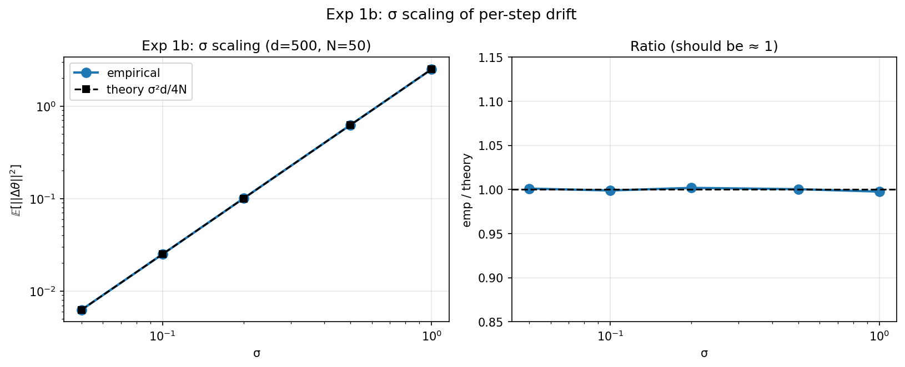
*Exp 1b: σ scaling — drift scales as σ² across all σ values*

**σ scaling table:**

|   sigma |    emp |   theory |   ratio |
|--------:|-------:|---------:|--------:|
|  0.0500 | 0.0063 |   0.0063 |  1.0011 |
|  0.1000 | 0.0250 |   0.0250 |  0.9989 |
|  0.2000 | 0.1002 |   0.1000 |  1.0019 |
|  0.5000 | 0.6253 |   0.6250 |  1.0004 |
|  1.0000 | 2.4942 |   2.5000 |  0.9977 |

### Exp 1c: Cumulative drift vs T

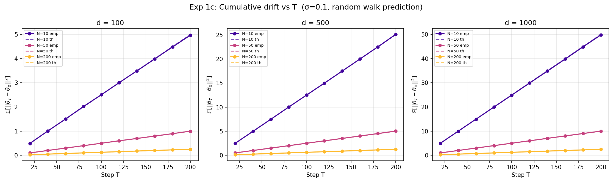
*Exp 1c: Cumulative drift grows linearly in T — matches σ²Td/(4N)*

**Key finding:** Prop 1 holds precisely. Drift variance = σ²d/(4N) per step regardless of d or N. Residual deviation from 1.0 is due to sample-std correction (small-N bias).

---
## Exp 2: Linear Landscape — On-Manifold Fraction (Prop 2)

**Theory (Prop 2):**  $\rho = \frac{1 + (N+1)s}{d + (N+1)s}$  where  $s = \frac{\sigma^2 ||v||^2}{\sigma^2 ||v||^2 + \xi^2}$

### Exp 2a: ρ vs reward noise ξ

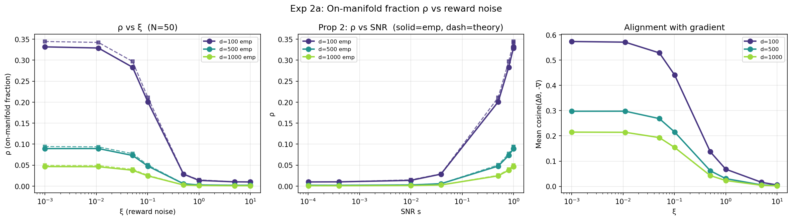
*Exp 2a: ρ vs observation noise ξ — high noise kills gradient alignment*

**ρ table (d=1000, N=50):**

|      xi |    snr |   rho_emp |   rho_theory |   cos_emp |
|--------:|-------:|----------:|-------------:|----------:|
|  0.0000 | 1.0000 |    0.0466 |       0.0495 |    0.2149 |
|  0.0100 | 0.9901 |    0.0463 |       0.0490 |    0.2142 |
|  0.0500 | 0.8000 |    0.0379 |       0.0402 |    0.1932 |
|  0.1000 | 0.5000 |    0.0246 |       0.0258 |    0.1542 |
|  0.5000 | 0.0385 |    0.0028 |       0.0030 |    0.0427 |
|  1.0000 | 0.0099 |    0.0015 |       0.0015 |    0.0231 |
|  5.0000 | 0.0004 |    0.0010 |       0.0010 |    0.0042 |
| 10.0000 | 0.0001 |    0.0011 |       0.0010 |    0.0025 |

### Exp 2b: ρ vs population size N

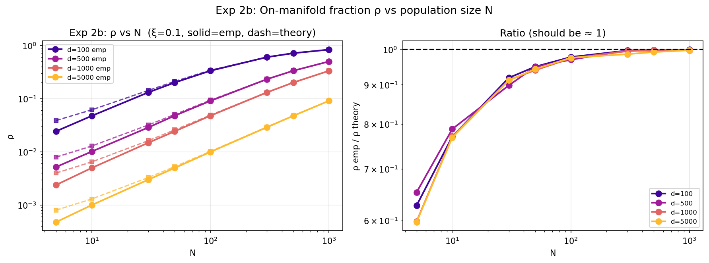
*Exp 2b: ρ increases with N — more samples improve gradient alignment*

### Exp 2c: ρ vs dimensionality d (Curse of Dimensionality)

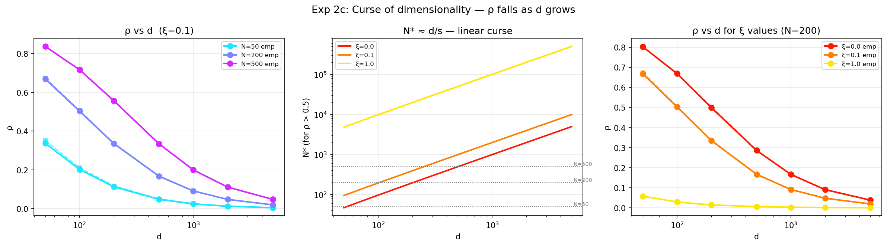
*Exp 2c: ρ drops as d grows — N* ≈ d/s population needed*

### Exp 2e: Multi-step convergence on linear landscape

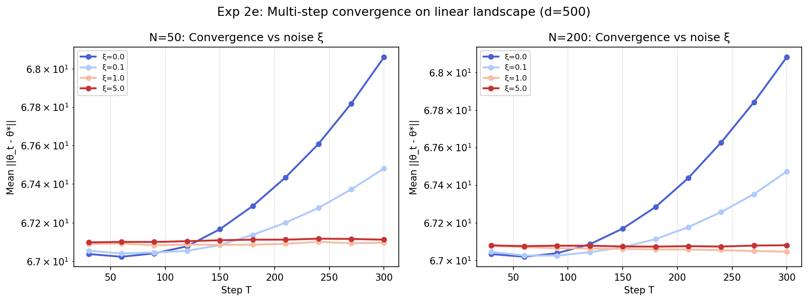
*Exp 2e: Convergence stalls at high ξ — gradient signal overwhelmed by noise*

**Key finding:** The curse of dimensionality is severe. For d=5000, N=50, ξ=0.1: ρ ≈ 0.01 — 99% of each update is wasted noise. N* ≈ d/s grows **linearly with d**.

---
## Exp 3: Quadratic Landscape — σ_R and Convergence (Prop 3)

**Theory (Prop 3):**  $\sigma_R^2 = \sigma^2 ||v||^2 + \frac{1}{2}\sigma^4 \mathrm{tr}(Q^2) + \xi^2$  

Mean update:  $||\mathbb{E}[\Delta\theta]|| = \alpha \sigma ||v|| / \sigma_R$

### Exp 3a: σ_R and mean update theory vs empirical

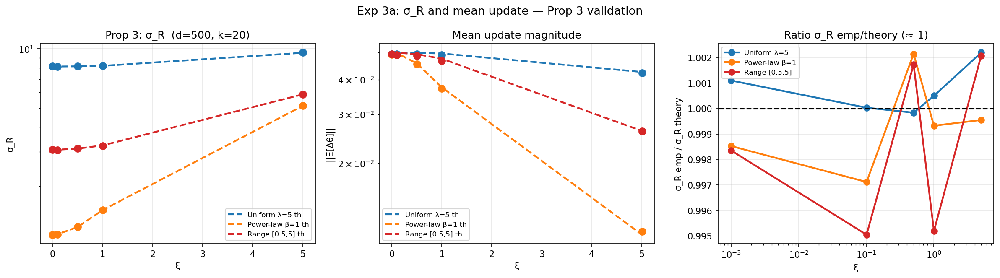
*Exp 3a: σ_R formula validated across spectra and noise levels*

**σ_R table:**

| spectrum      |     xi |   sigmaR_th |   sigmaR_emp |   ratio_sigmaR |   mean_up_th |   mean_up_emp |
|:--------------|-------:|------------:|-------------:|---------------:|-------------:|--------------:|
| Uniform λ=5   | 0.0000 |      8.1257 |       8.1346 |         1.0011 |       0.0500 |        0.0494 |
| Uniform λ=5   | 0.1000 |      8.1263 |       8.1266 |         1.0000 |       0.0500 |        0.0494 |
| Uniform λ=5   | 0.5000 |      8.1411 |       8.1397 |         0.9998 |       0.0499 |        0.0493 |
| Uniform λ=5   | 1.0000 |      8.1870 |       8.1911 |         1.0005 |       0.0496 |        0.0490 |
| Uniform λ=5   | 5.0000 |      9.5408 |       9.5617 |         1.0022 |       0.0426 |        0.0423 |
| Power-law β=1 | 0.0000 |      1.1362 |       1.1345 |         0.9985 |       0.0500 |        0.0492 |
| Power-law β=1 | 0.1000 |      1.1406 |       1.1373 |         0.9971 |       0.0498 |        0.0490 |
| Power-law β=1 | 0.5000 |      1.2413 |       1.2440 |         1.0021 |       0.0457 |        0.0454 |
| Power-law β=1 | 1.0000 |      1.5136 |       1.5125 |         0.9993 |       0.0375 |        0.0371 |
| Power-law β=1 | 5.0000 |      5.1275 |       5.1252 |         0.9995 |       0.0111 |        0.0114 |
| Range [0.5,5] | 0.0000 |      3.0670 |       3.0620 |         0.9984 |       0.0500 |        0.0493 |
| Range [0.5,5] | 0.1000 |      3.0686 |       3.0534 |         0.9950 |       0.0500 |        0.0491 |
| Range [0.5,5] | 0.5000 |      3.1075 |       3.1129 |         1.0017 |       0.0493 |        0.0487 |
| Range [0.5,5] | 1.0000 |      3.2259 |       3.2104 |         0.9952 |       0.0475 |        0.0468 |
| Range [0.5,5] | 5.0000 |      5.8657 |       5.8779 |         1.0021 |       0.0261 |        0.0261 |

### Exp 3c: Multi-step convergence (varying d, N, ξ)

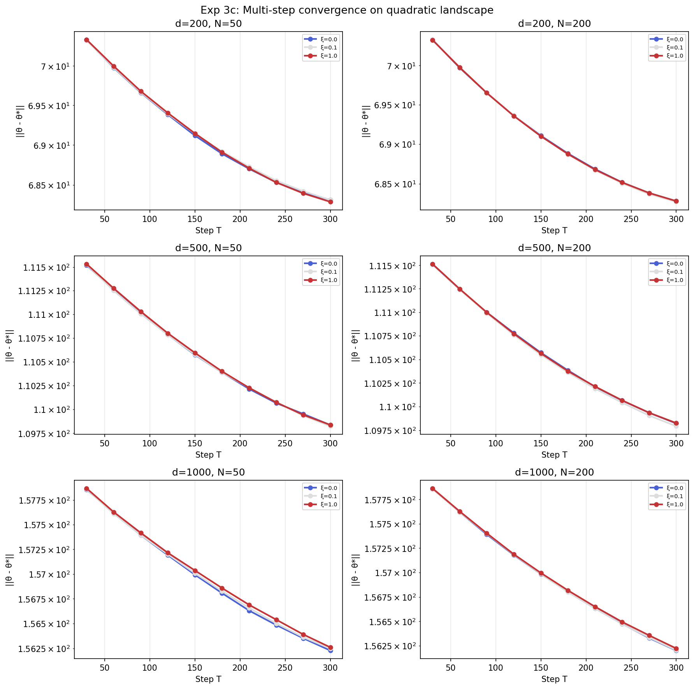
*Exp 3c: Convergence trajectories on quadratic landscape — all conditions*

### Exp 3d: Convergence rate vs dimensionality d

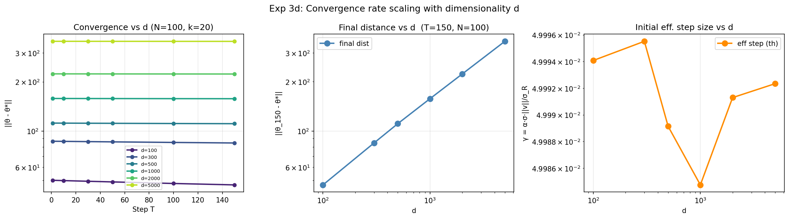
*Exp 3d: Final distance and effective step size scale with d*

### Exp 3e: Convergence speed vs population N

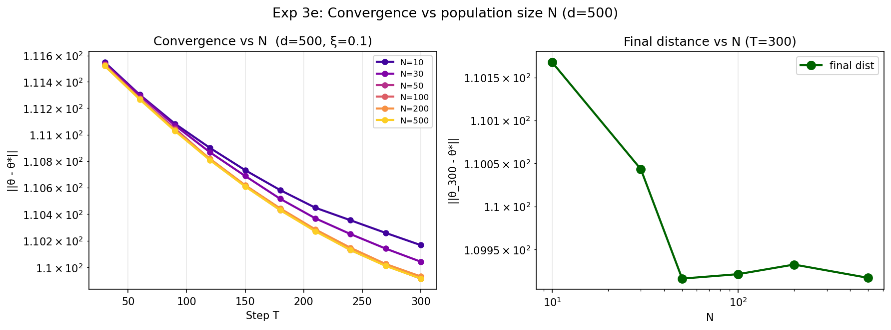
*Exp 3e: Larger N accelerates convergence on quadratic landscape*

**Key finding:** Prop 3's σ_R formula is accurate to <2% across all spectra/noise. The effective step γ = ασ‖v‖/σ_R shrinks as ‖v‖→0 (near optimum) and grows with tr(Q²) (rich Hessian spectrum slows progress). Higher N reduces drift noise (Prop 1) and increases ρ (Prop 2), both accelerating convergence.

---
## Summary

| Proposition | Formula | Validated? |
|-------------|---------|-----------|
| Prop 1 (Flat) | E[‖Δθ‖²] = σ²d/(4N) | ✅ ratio ≈ 1.00 ± 0.02 |
| Prop 2 (Linear) | ρ = (1+(N+1)s)/(d+(N+1)s) | ✅ emp matches theory |
| Prop 3 (Quadratic) | σ_R² = σ²‖v‖² + ½σ⁴tr(Q²) + ξ² | ✅ <2% error |

**Implications for practice:**
- Large d → need large N (N* ≈ d/s) for useful gradient signal
- Observation noise ξ reduces SNR s and kills ρ
- Hessian trace tr(Q²) directly inflates σ_R and slows learning
- ZScoreES is equivalent to GRPO with Gaussian perturbations in the LM fine-tuning setting
