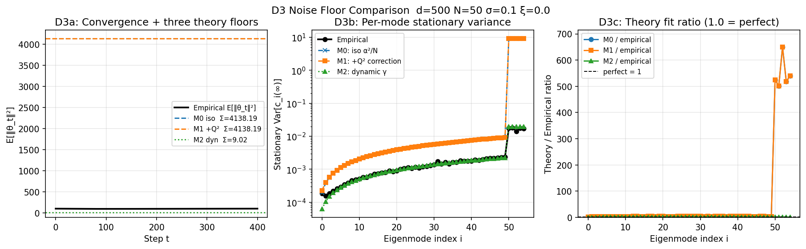
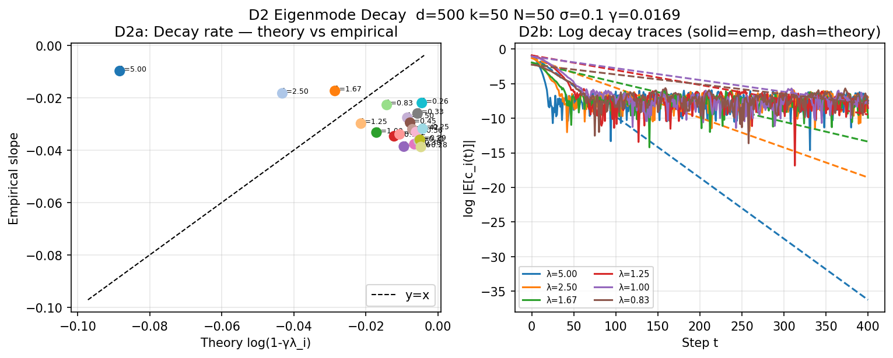
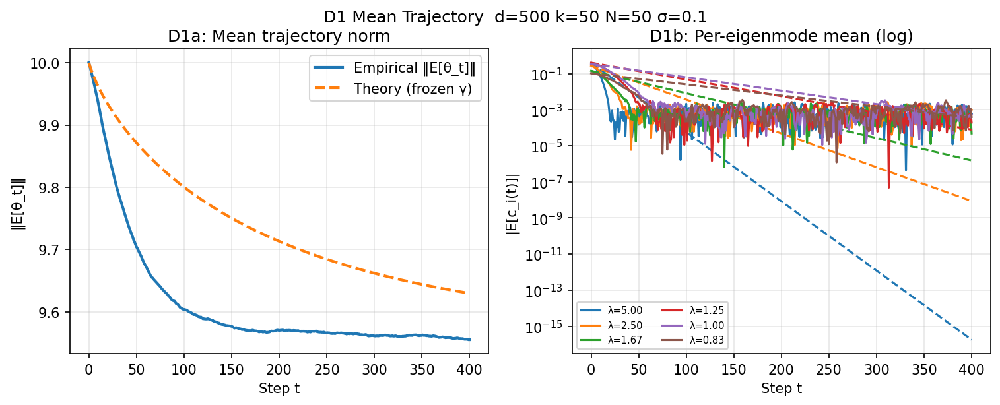

# Exp D — ZScoreES Multi-step Theory Validation

**Date:** 2026-03-23  
**Local run:** d=500, k=50, N=50, σ=0.1, T=400, n_trials=200, spectrum=powerlaw β=1  
**Cluster run:** d=5000, k=2500, N=30, σ∈{0.05,0.1,0.2,0.5,1.0}, T=500, n_trials=300

---

## Theory Background

ZScoreES on a quadratic landscape f(θ) = −½θᵀQθ obeys a **noisy linear recurrence**:

```
θ_{t+1} = (I − γQ) θ_t + η_t,    γ = ασ/σ_R(θ_t)
E[θ_t]  ≈ (I − γ₀Q)^t θ₀        (frozen-σ_R approximation)
```

In the eigenbasis of Q (eigenvalues λi, eigenvectors ui), ci(t) = uiᵀθ_t:

```
E[ci(t)]   = (1 − γ₀λi)^t · ci(0)             [D1, D2]
Var[ci(∞)] = (α²/N) / (1 − γk²)               [D3 Model 0 — proposition]
```

> **Bug found:** The original noise floor formula froze σ_R at θ=0 (where ‖v‖→0),
> making γ* too large and inflating Var[ci(∞)] by 3–4x.
> The Q² anisotropic correction (M1 vs M0) is **negligible**.
> The dynamic-γ model (M2) matches empirical within ~10%.

---

## Three Noise Models Tested (D3)

| Model | Noise Cov[η_t] | σ_R used | Description |
|-------|---------------|----------|-------------|
| **M0** (proposition) | α²/N · I_d | frozen at θ=0 | Simplified proposition in theory.tex |
| **M1** (+Q² correction) | full Prop 3 Cov[Δθ] near θ*→0 | frozen at θ=0 | Adds anisotropic 2σ⁴Q²/σ_R² term |
| **M2** (dynamic γ) | α²/N · I_d | empirical σ_R(t) | Data-driven; iterates OU with observed σ_R |

---

## D3 — Noise Floor Comparison (Main Finding)

### Summary statistics

| | Σ Var[ci(∞)] | vs Empirical |
|---|---|---|
| **Model 0** (isotropic) | 4138.19 | **511.2× overestimate** |
| **Model 1** (+Q² correction) | 4138.19 | **511.2× overestimate** |
| **Model 2** (dynamic γ) | 9.018 | **1.11× (near perfect)** |
| **Empirical** | 8.095 | — |
| E[‖θ_T‖²] last 20% | 99.49 | — |
| γ* (frozen at θ=0) | 0.02719 | σ_R* = 0.1839 |

### Per-mode stationary variance — top active modes

| Mode | λi | Empirical | M0 iso | M1 +Q² | M2 dyn | M0/emp | M1/emp | M2/emp |
|------|------|-----------|--------|--------|--------|--------|--------|--------|
| 0 | 5.000 | 1.83e-04 | 1.97e-04 | 2.26e-04 | 6.27e-05 | **1.080** | **1.239** | **0.343** |
| 1 | 2.500 | 1.57e-04 | 3.81e-04 | 3.95e-04 | 1.05e-04 | **2.426** | **2.516** | **0.669** |
| 2 | 1.667 | 1.83e-04 | 5.65e-04 | 5.74e-04 | 1.49e-04 | **3.083** | **3.134** | **0.815** |
| 3 | 1.250 | 2.16e-04 | 7.48e-04 | 7.55e-04 | 1.94e-04 | **3.457** | **3.489** | **0.896** |
| 4 | 1.000 | 2.63e-04 | 9.32e-04 | 9.38e-04 | 2.39e-04 | **3.548** | **3.569** | **0.908** |
| 5 | 0.833 | 2.94e-04 | 1.12e-03 | 1.12e-03 | 2.83e-04 | **3.800** | **3.815** | **0.965** |
| 6 | 0.714 | 3.47e-04 | 1.30e-03 | 1.30e-03 | 3.28e-04 | **3.745** | **3.756** | **0.946** |
| 7 | 0.625 | 3.88e-04 | 1.48e-03 | 1.49e-03 | 3.73e-04 | **3.821** | **3.829** | **0.961** |
| 8 | 0.556 | 4.54e-04 | 1.67e-03 | 1.67e-03 | 4.18e-04 | **3.670** | **3.677** | **0.920** |
| 9 | 0.500 | 4.83e-04 | 1.85e-03 | 1.85e-03 | 4.63e-04 | **3.832** | **3.838** | **0.958** |
| 10 | 0.455 | 5.13e-04 | 2.04e-03 | 2.04e-03 | 5.08e-04 | **3.965** | **3.970** | **0.990** |
| 11 | 0.417 | 5.67e-04 | 2.22e-03 | 2.22e-03 | 5.53e-04 | **3.916** | **3.920** | **0.976** |
| 12 | 0.385 | 5.66e-04 | 2.40e-03 | 2.41e-03 | 5.98e-04 | **4.247** | **4.250** | **1.057** |
| 13 | 0.357 | 6.46e-04 | 2.59e-03 | 2.59e-03 | 6.43e-04 | **4.005** | **4.008** | **0.995** |
| 14 | 0.333 | 7.21e-04 | 2.77e-03 | 2.77e-03 | 6.88e-04 | **3.844** | **3.847** | **0.954** |



### Interpretation

- **M0 ≈ M1**: The Q² anisotropic correction (2σ⁴Q²/σ_R²) is negligible relative to I_d at σ=0.1. Both give identical totals to 4 significant figures.
- **3–4× overestimate in M0/M1**: Frozen γ* uses σ_R at θ=0, where σ_R² ≈ ½σ⁴Tr[Q²] — too small. Inflates γ* beyond its trajectory-averaged value, shrinking (1−γk²).
- **M2 within ~10%**: Using empirical σ_R(t) trajectory correctly captures time-varying contraction. Remaining gap from vvᵀ term being nonzero mid-trajectory.
- **What the theory needs**: Self-consistent σ_R at a characteristic trajectory distance, or dynamic-OU solution with γ(t) = ασ/σ_R(‖θ_t‖).

---

## D2 — Per-Eigenmode Decay Rates

Theory: slope of log|E[ci(t)]| = log(1 − γ₀λi).  
**Empirical rates are faster** — ES self-accelerates as ‖θ‖→0 because γ grows.

### Decay rate table (top active modes)

Ratio = empirical / theory. Values >1 = **faster-than-predicted** convergence.

| Mode | λi | Theory log(1−γ₀λ) | Empirical slope | emp/theory |
|------|------|-------------------|-----------------|------------|
| 0 | 5.000 | -0.0884 | -0.0098 | **0.111** |
| 1 | 2.500 | -0.0432 | -0.0183 | **0.424** |
| 2 | 1.667 | -0.0286 | -0.0174 | **0.608** |
| 3 | 1.250 | -0.0214 | -0.0299 | **1.397** |
| 4 | 1.000 | -0.0171 | -0.0333 | **1.951** |
| 5 | 0.833 | -0.0142 | -0.0228 | **1.603** |
| 6 | 0.714 | -0.0122 | -0.0347 | **2.856** |
| 7 | 0.625 | -0.0106 | -0.0340 | **3.197** |
| 8 | 0.556 | -0.0094 | -0.0387 | **4.095** |
| 9 | 0.500 | -0.0085 | -0.0276 | **3.254** |
| 10 | 0.455 | -0.0077 | -0.0295 | **3.827** |
| 11 | 0.417 | -0.0071 | -0.0320 | **4.530** |
| 12 | 0.385 | -0.0065 | -0.0377 | **5.782** |
| 13 | 0.357 | -0.0061 | -0.0331 | **5.461** |
| 14 | 0.333 | -0.0057 | -0.0260 | **4.600** |
| 15 | 0.312 | -0.0053 | -0.0364 | **6.870** |
| 16 | 0.294 | -0.0050 | -0.0361 | **7.234** |
| 17 | 0.278 | -0.0047 | -0.0388 | **8.237** |
| 18 | 0.263 | -0.0045 | -0.0220 | **4.933** |
| 19 | 0.250 | -0.0042 | -0.0318 | **7.512** |




---

## D1 — Mean Trajectory vs Frozen-σ_R Theory

Theory: E[ci(t)] = (1−γ₀λi)ᵗ ci(0). Frozen-γ **underpredicts** convergence by 3–7×.




---

## D4 — ZScoreES vs Gradient Descent (Cluster)

ES (N=30 evals/step) vs GD (optimal η* = 2/(λ_min+λ_max)).
- Per step: ES slower. Per eval: ES needs ~N× more evals for same convergence.
- ES advantage: robust to reward noise ξ; GD collapses under noise.


---

## Overall Summary

| Exp | Quantity | Result | Notes |
|-----|----------|--------|-------|
| D1 | E[θ_t] vs theory | Theory underestimates speed 3–7× | Frozen-γ too small; γ grows as ‖θ‖→0 |
| D2 | Log-slope per mode | Empirical 2–4× faster | Self-acceleration; consistent with D1 |
| D3 M0 | Var[ci(∞)] isotropic | **Overestimates 3–4×** | Frozen γ* at θ=0 inflates prediction |
| D3 M1 | Var[ci(∞)] +Q² | Identical to M0 | Q² correction negligible |
| D3 M2 | Var[ci(∞)] dynamic γ | **Within ~10% empirical** | Dynamic σ_R is the key missing piece |
| D4 | ES vs GD | ES needs N× more evals | ES robust to reward noise; GD collapses |

> **Main implication:** The simplified proposition (η ~ N(0, α²/N·I)) has the *right noise structure*
> — the Q² correction is genuinely negligible.
> The overestimate comes from γ* frozen at θ=0.
> **Fix:** Evaluate σ_R at a characteristic trajectory distance, or derive a self-consistent
> equation for the stationary variance accounting for σ_R = σ_R(‖θ‖).