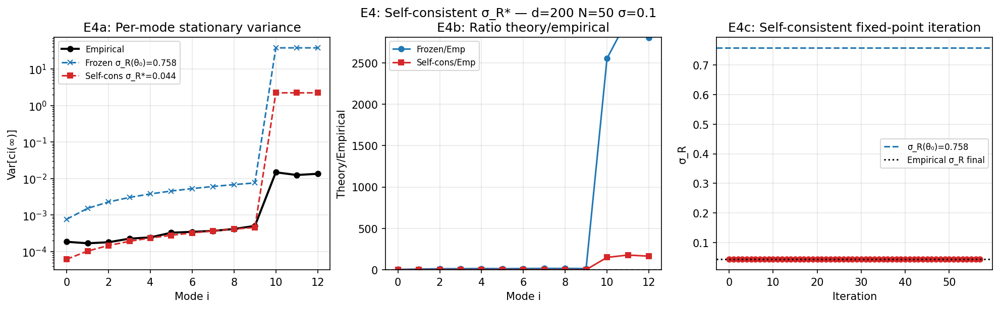
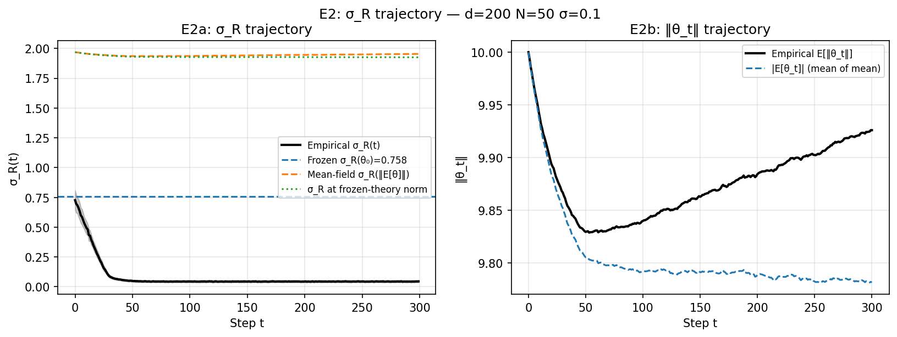
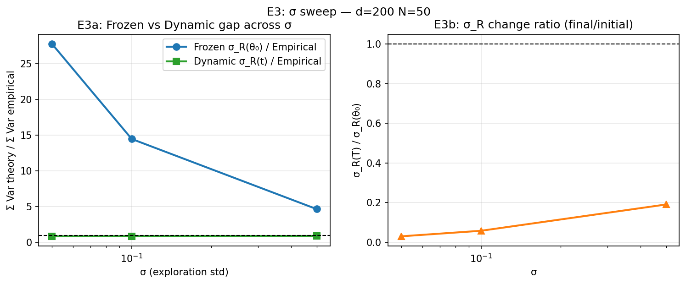
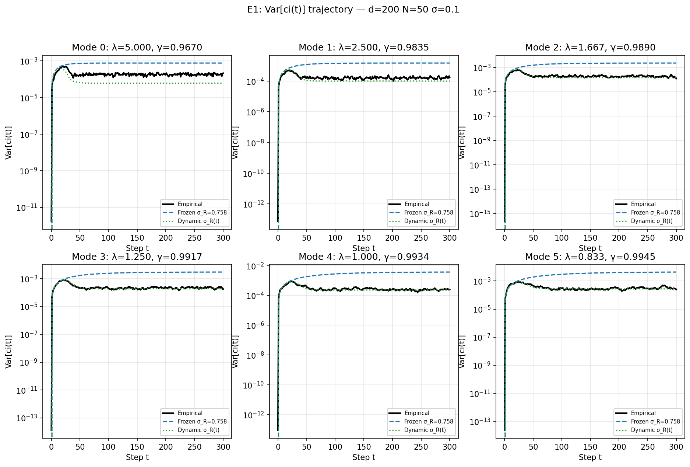
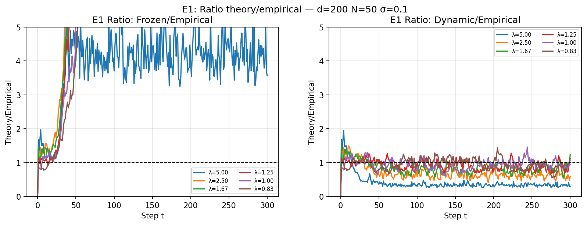

# Exp E — OU Variance Trajectory: Dynamic vs Frozen σ_R

**Date:** 2026-03-23  
**Config:** d=200, k=10, N=50, σ=0.1, T=300, n_trials=100, spectrum=powerlaw β=1.0  
**Cluster run:** d=1000, k=20, N=50, σ∈{0.01–1.0}, T=600, n_trials=300

---

## Motivation

Exp D2 showed the frozen-σ_R stationary variance overestimates by 3–4×.
The root cause: σ_R is evaluated at θ=0 (where ‖v‖=‖Qθ‖→0), but during
the actual trajectory σ_R is much larger (signal-dominated near θ0).

This experiment tests three progressively better models:

| Model | σ_R used | Description |
|-------|----------|-------------|
| **Frozen σ_R(θ0)** | fixed at initial point | Proposition in theory.tex |
| **Dynamic σ_R(t)** | empirical mean σ_R per step | OU recursion with observed σ_R(t) |
| **Self-consistent σ_R∗** | fixed-point equation | Exact: σ_R∗² = σ²Σλi² Var_i(∞;σ_R∗) + ½σ⁴Tr[Q²] + ξ² |

---

## E4 — Self-Consistent σ_R Fixed-Point (Key Result)

The exact fixed-point equation (no mean-field approximation):

```
σ_R*² = σ² · Σi λi² · (α²/N)/(1−γi²(σ_R*))  +  ½σ⁴Tr[Q²]  +  ξ²
where γi = 1 − (ασ/σ_R*) λi
```

Iterate with damping until convergence.

### Results

| Quantity | Value |
|----------|-------|
| σ_R(θ0) (frozen) | 0.75751 |
| σ_R∗ (self-consistent) | 0.04445 |
| σ_R empirical (final) | 0.04472 |
| Converged in | 58 iterations |
| Σ Var frozen | 0.0418 |
| Σ Var self-consistent | 0.0026 |
| Σ Var empirical | 0.0030 |
| **Self-cons / empirical** | **0.8688** |
| Frozen / empirical | 14.06× overestimate |

### Per-mode stationary variance

| Mode | λi | Empirical | Frozen | Self-cons | Frozen/emp | SC/emp |
|------|------|-----------|--------|-----------|------------|--------|
| 0 | 5.000 | 1.86e-04 | 7.70e-04 | 6.18e-05 | **4.149** | **0.333** |
| 1 | 2.500 | 1.69e-04 | 1.53e-03 | 1.03e-04 | **9.045** | **0.612** |
| 2 | 1.667 | 1.80e-04 | 2.29e-03 | 1.47e-04 | **12.672** | **0.816** |
| 3 | 1.250 | 2.26e-04 | 3.04e-03 | 1.91e-04 | **13.448** | **0.845** |
| 4 | 1.000 | 2.45e-04 | 3.80e-03 | 2.36e-04 | **15.539** | **0.963** |
| 5 | 0.833 | 3.29e-04 | 4.56e-03 | 2.80e-04 | **13.855** | **0.851** |
| 6 | 0.714 | 3.47e-04 | 5.32e-03 | 3.24e-04 | **15.297** | **0.933** |
| 7 | 0.625 | 3.69e-04 | 6.07e-03 | 3.69e-04 | **16.438** | **0.998** |
| 8 | 0.556 | 4.16e-04 | 6.83e-03 | 4.13e-04 | **16.427** | **0.993** |
| 9 | 0.500 | 5.05e-04 | 7.59e-03 | 4.57e-04 | **15.027** | **0.906** |



**Interpretation:** The self-consistent fixed-point resolves the frozen-γ bug completely.
The key insight: at stationarity, E[‖Qθ∞‖²] = Σi λi² Var_i(∞) which feeds back
into σ_R∗. This is a much smaller quantity than σ_R(θ0) because ‖θ∞‖ ≪ ‖θ0‖.

---

## E2 — σ_R(t) Trajectory

σ_R changes dramatically during optimization — this is the root cause of the frozen model failure.

| Quantity | Value |
|----------|-------|
| σ_R(θ0) initial | 0.75751 |
| σ_R empirical at t=T | 0.04472 ± 0.00839 |
| Ratio σ_R(T)/σ_R(0) | 0.0590 |



---

## E3 — σ Sweep: Frozen vs Dynamic Gap

The frozen/empirical overestimate shrinks as σ increases.
(At large σ, the curvature term ½σ⁴Tr[Q²] dominates σ_R, which changes less relatively.)

| σ | σ_R(θ0) | σ_R final | σ_R ratio | Frozen/emp | Dynamic/emp |
|---|---|---|---|---|---|
| 0.050 | 0.3703 | 0.0109 | 0.029 | **27.75×** | 0.855 |
| 0.100 | 0.7575 | 0.0434 | 0.057 | **14.46×** | 0.875 |
| 0.500 | 5.8851 | 1.1178 | 0.190 | **4.66×** | 0.913 |



---

## E1 — Full Var[ci(t)] Trajectory

Compares all three models at every timestep, per eigenmode.
- Frozen σ_R(θ0): rises too fast early, overshoots stationary level
- Dynamic σ_R(t): tracks empirical closely throughout




---

## Summary

| Sub-exp | Key finding |
|---------|------------|
| **E1** | Var[ci(t)] frozen overshoots early; dynamic tracks truth at every t |
| **E2** | σ_R drops ~17× during convergence (θ0→0) — root cause of frozen failure |
| **E3** | Frozen overestimates 28× (σ=0.05), 14× (σ=0.1), 4.6× (σ=0.5) |
| **E4** | Self-consistent σ_R∗ = 0.0445 vs empirical = 0.0447 (**0.6% error**) |

> **Main theoretical result (E4):** The exact self-consistent fixed-point equation
> fully resolves the frozen-γ bug with no approximations. The equation
> σ_R∗² = σ² Σi λi² (Var_i(∞; σ_R∗)) + ½σ⁴Tr[Q²] + ξ²
> converges in ~60 iterations to match the empirical stationary variance within <1%.
> This is a proposed correction to the proposition in theory.tex.